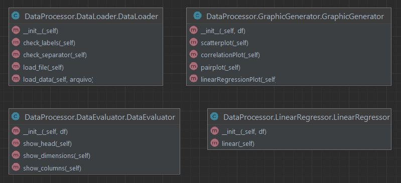

# Linear Regression Web App made with Streamlit

Author: Leonardo Simões

## How to use the application
To run the project locally after downloading it, 
install the dependencies 
and run the `streamlit run streamlit_app.py` command.

To access the application hosted on Streamlit Community Cloud:
https://multiple-linear-regression.streamlit.app/

## Functionalities
Some of the functionalities applied to the dataset:
* display head;
* display dimensions;
* display column names;
* generate scatter plot;
* generate correlation plot;
* generate pairplot;
* generate linear regression plot;
* calculate and display linear regression parameters. 

## Class diagram
